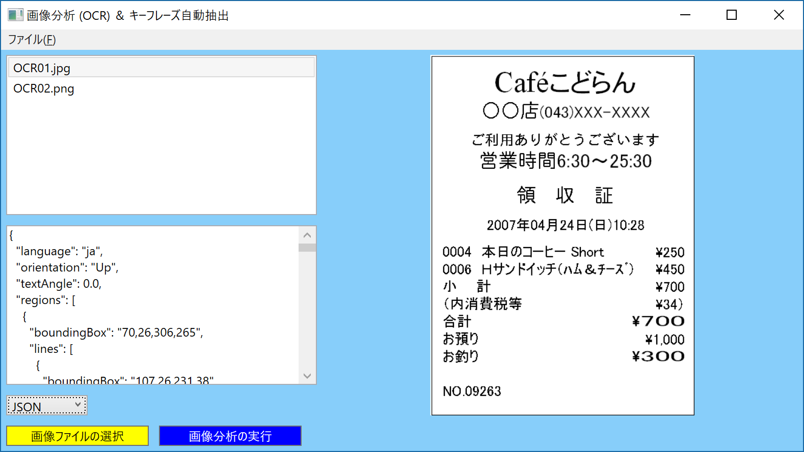
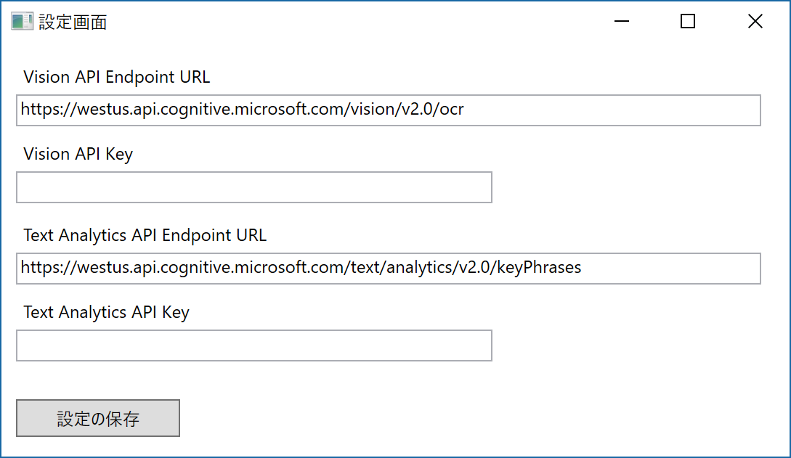
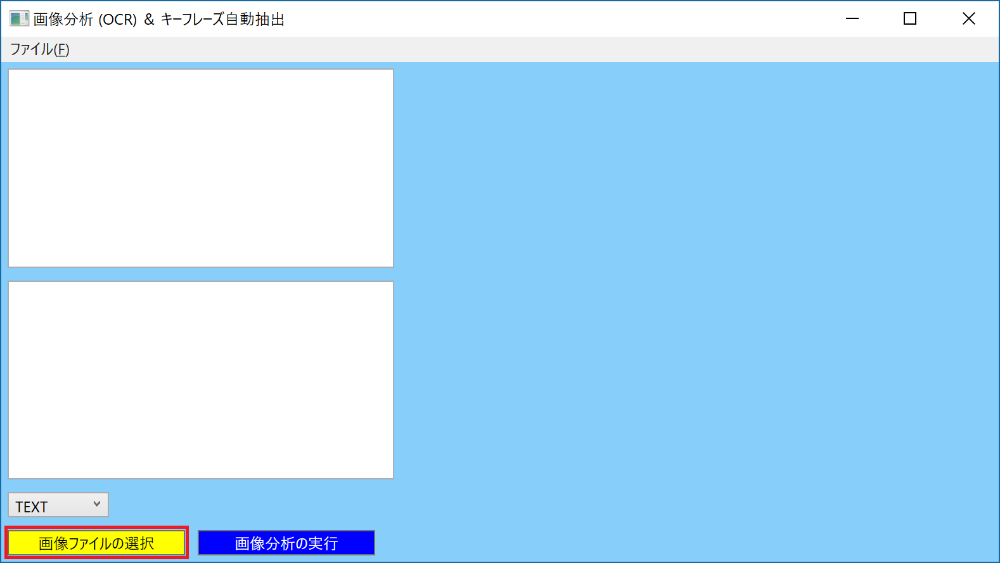
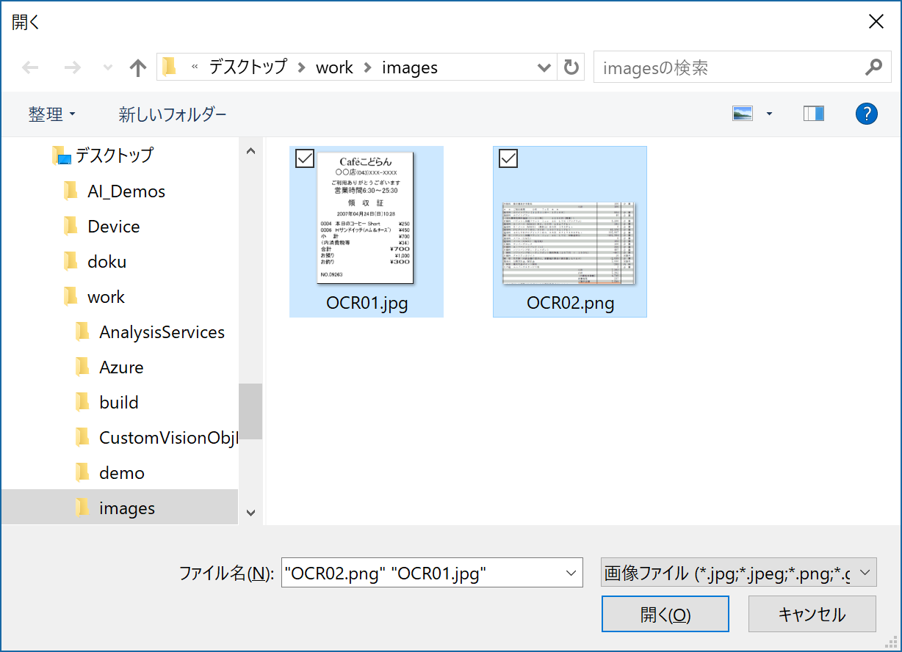
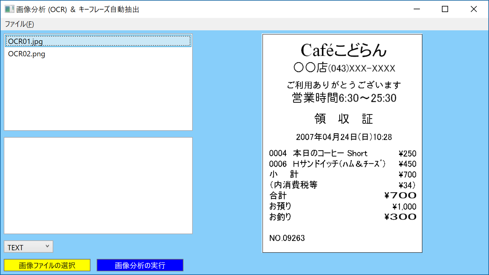
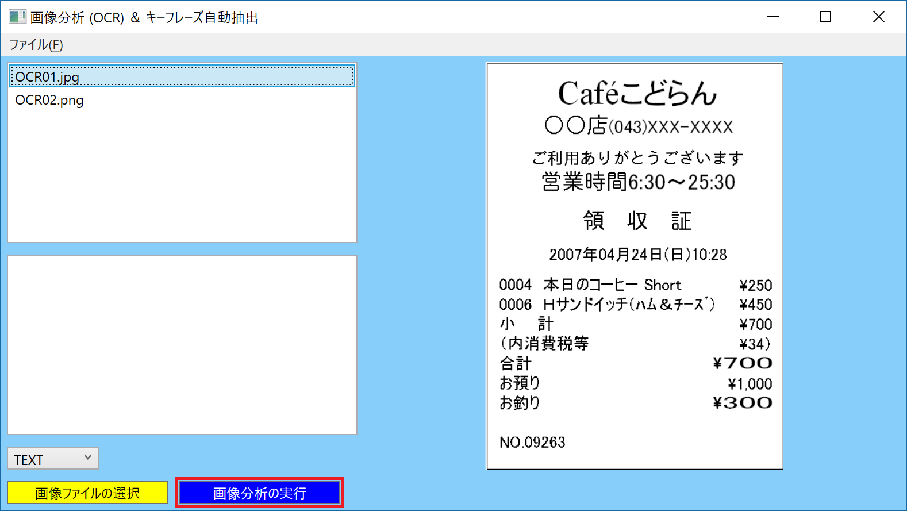
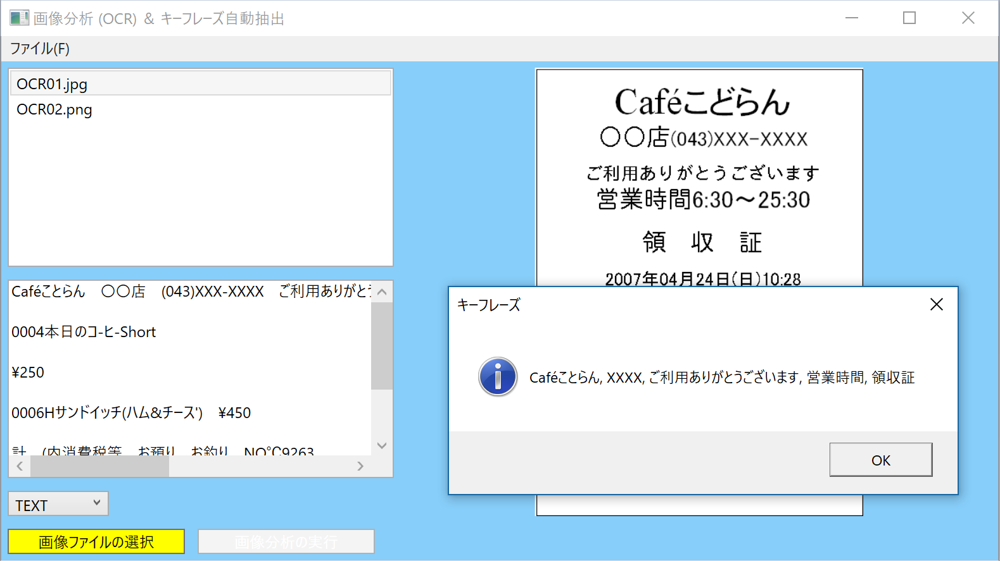

# ComputerVisionOCR
Azure Cognitive Services - Computer Vision API の OCR 機能と Azure Cognitive Services - Text Analytics API キーフレーズ自動抽出機能を利用した以下のような画像解析 WPF アプリケーションのサンプルコードとなります。インストーラー (Installer.zip) も用意しておりますので、お試しください。 
  
## このアプリケーションの利用手順を以下に記載します。  
アプリケーションを起動すると、設定画面が表示されますので、Azure Portal で作成した Cognitive Services の Computer Vision API と Text Analytics API のエンドポイントとキーを設定し、「設定の保存」をクリックしてください。再度、設定が必要な場合は、メイン画面の「ファイル」メニューの「設定画面の表示」をクリックしてください。  
  
設定を終えると、メイン画面が表示されますので、解析したい画像ファイルを選択します。複数の画像ファイルを同時に選択することが可能です。
 
  
選択した画像ファイル名をクリックすると、プレビュー表示されます。
  
分析したい画像ファイル名を選択し、「画像分析の実行」ボタンをクリックすると、Computer Vision API と Text Analytics API が呼び出されます。
  
実行結果は、以下のように表示されます。メッセージ ボックスには、キーフレーズが表示され、メイン画面左下に OCR 機能で読み取ったテキストが表示されます。
  
コンボボックスで、「JSON」を指定すると、Computer Vision API から返却されたそのままの JSON が表示されます。
  

